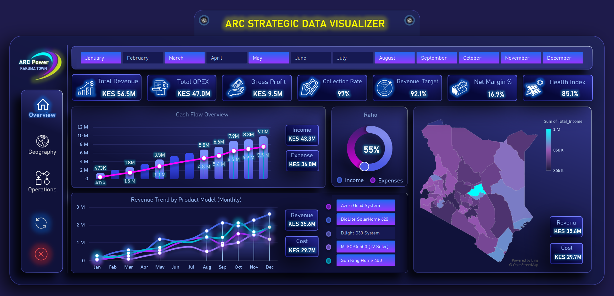
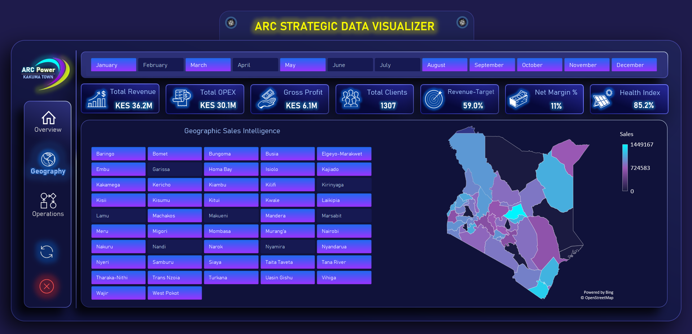
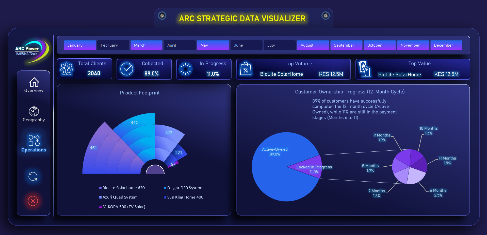
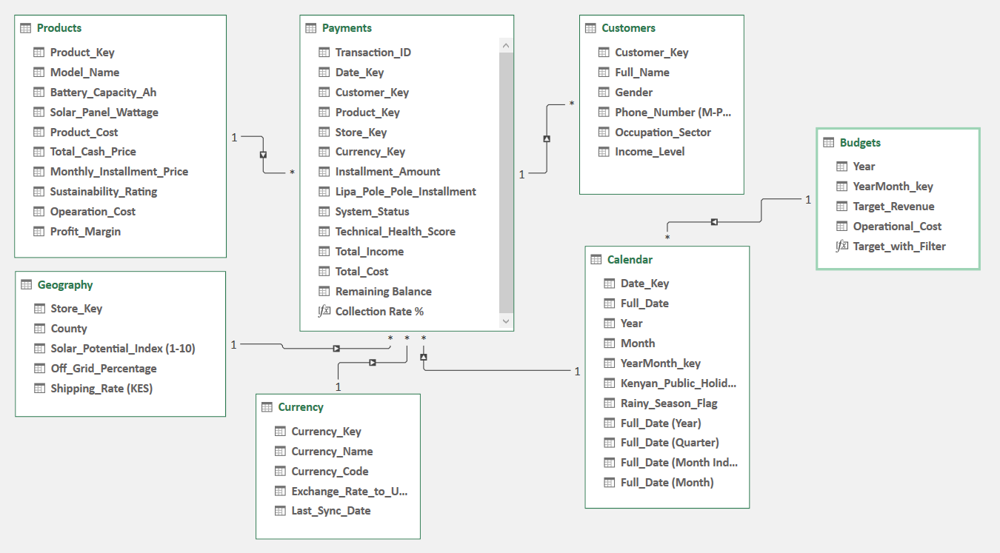

# ☀️ Kenya Solar PAYGO Strategic Analytics 🇰🇪
### Transforming Raw Installment Data into Credit Risk Intelligence

## 🎯 Business Context: The PAYGO Challenge
In the Kenyan renewable energy sector, managing 12-month installment plans is a high-stakes balancing act between market expansion and **Credit Risk Management**. This project bridges the gap between raw daily transactions and executive-level strategic decision-making.

## 🧠 Strategic Insights & Solved Problems
This dashboard is engineered to solve 3 critical business bottlenecks:

### 1. Executive Overview: Profitability vs. OPEX
* **The Problem:** Scaling sales often masks rising operational costs, leading to "growth without profit."
* **The Solution:** A high-level view of **Net Margin** and **Revenue Trends** that ensures every solar unit sold contributes to the bottom line.

### 2. Geographic Intelligence: Regional Collection Risk
* **The Problem:** Payment behavior varies significantly across Kenya's 47 counties; a "one-size-fits-all" collection strategy fails.
* **The Solution:** Visualizing **Collection Rates by County** allows management to deploy field agents to high-risk areas while identifying the most stable regions for expansion.

### 3. Operational Performance: The 12-Month Lifecycle
* **The Problem:** Customer "Churn" or default typically peaks at months 3-5.
* **The Solution:** An **Ownership Progress Tracker** that monitors the health of each contract, allowing for early intervention before a customer becomes a "Write-off."

## 🧪 Technical Deep-Dive (The "Engine")
* **Relational Data Modeling:** Built on a professional **Star Schema** architecture to ensure lightning-fast performance even with high transaction volumes.
* **Advanced DAX Metrics:**
    * `Collection Efficiency %`: Real-time tracking of (Actual Payments / Expected Installments).
    * `Portfolio at Risk (PAR)`: Identifying delinquent accounts based on 30/60/90 day buckets.
* **VBA UI Customization:** Implemented an "App-like" experience by programmatically hiding Excel's Ribbon and Formula Bar to keep the user focused on the data.

## ⚙️ Data Architecture

---
## ℹ️ Disclaimer & Data Attribution
* **Project Context:** This is a professional simulation/capstone project. 
* **Organization:** The analysis is based on a fictional entity named **ARC Power**.
* **Data Nature:** The dataset is **Synthetic**, specifically engineered to mirror the real-world market dynamics, consumer behavior, and cultural payment patterns of the **Kenyan Solar Industry**. No sensitive or private corporate data has been used.
---
**Main Tools:** Excel Power Pivot, DAX, Power Query, VBA.  
*Specialized for Solar Energy Operations, Financial Modeling, and Market Analytics in East Africa.*

